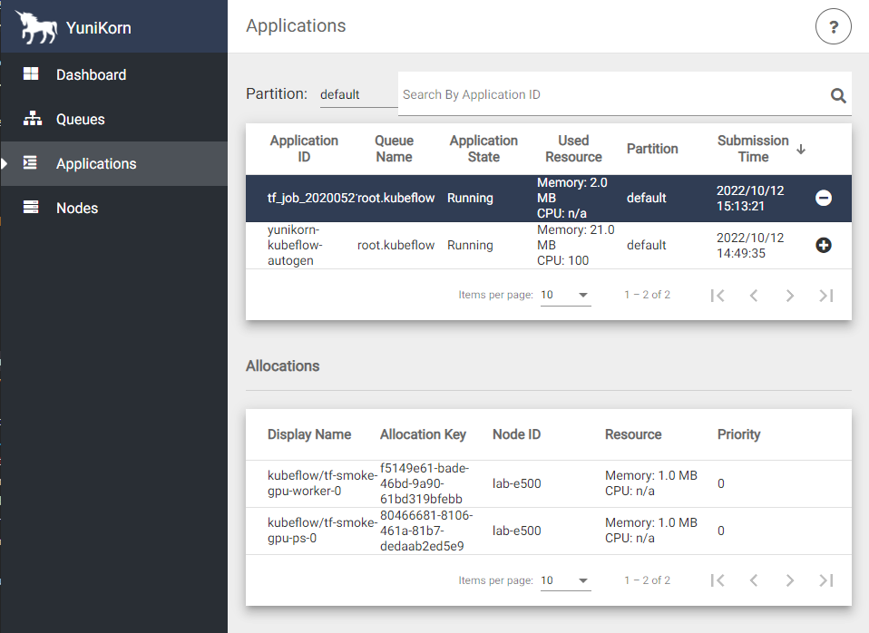

<!--
Licensed to the Apache Software Foundation (ASF) under one
or more contributor license agreements.  See the NOTICE file
distributed with this work for additional information
regarding copyright ownership.  The ASF licenses this file
to you under the Apache License, Version 2.0 (the
"License"); you may not use this file except in compliance
with the License.  You may obtain a copy of the License at

  http://www.apache.org/licenses/LICENSE-2.0

Unless required by applicable law or agreed to in writing,
software distributed under the License is distributed on an
"AS IS" BASIS, WITHOUT WARRANTIES OR CONDITIONS OF ANY
KIND, either express or implied.  See the License for the
specific language governing permissions and limitations
under the License.
-->

This guide gives an overview of how to set up [training-operator](https://github.com/kubeflow/training-operator)
and how to run a Tensorflow job with YuniKorn scheduler. The training-operator is a unified training operator maintained by
Kubeflow. It not only supports TensorFlow but also PyTorch, XGboots, etc.

## Install training-operator
You can use the following command to install training operator in kubeflow namespace by default. If you have problems with installation,
please refer to [this doc](https://github.com/kubeflow/training-operator#installation) for details.
```
kubectl apply -k "github.com/kubeflow/training-operator/manifests/overlays/standalone?ref=v1.3.0"
```

## Prepare the docker image
Before you start running a TensorFlow job on Kubernetes, you'll need to build the docker image.
1. Download files from [deployment/examples/tfjob](https://github.com/apache/yunikorn-k8shim/tree/master/deployments/examples/tfjob)
2. To build this docker image with the following command

```
docker build -f Dockerfile -t kubeflow/tf-dist-mnist-test:1.0 .
```

## Run a TensorFlow job
Here is a TFJob yaml for MNIST [example](https://github.com/apache/yunikorn-k8shim/blob/master/deployments/examples/tfjob/tf-job-mnist.yaml).

```yaml
apiVersion: kubeflow.org/v1
kind: TFJob
metadata:
  name: dist-mnist-for-e2e-test
  namespace: kubeflow
spec:
  tfReplicaSpecs:
    PS:
      replicas: 2
      restartPolicy: Never
      template:
        metadata:
          labels:
            applicationId: "tf_job_20200521_001"
            queue: root.sandbox
        spec:
          schedulerName: yunikorn
          containers:
            - name: tensorflow
              image: kubeflow/tf-dist-mnist-test:1.0
    Worker:
      replicas: 4
      restartPolicy: Never
      template:
        metadata:
          labels:
            applicationId: "tf_job_20200521_001"
            queue: root.sandbox
        spec:
          schedulerName: yunikorn
          containers:
            - name: tensorflow
              image: kubeflow/tf-dist-mnist-test:1.0
```
Create the TFJob
```
kubectl create -f deployments/examples/tfjob/tf-job-mnist.yaml
```
You can view the job info from YuniKorn UI. If you do not know how to access the YuniKorn UI,
please read the document [here](../../get_started/get_started.md#access-the-web-ui).


## Run a TensorFlow job with GPU scheduling
To use Time-Slicing GPU your cluster must be configured to use [GPUs and Time-Slicing GPUs](https://yunikorn.apache.org/docs/next/user_guide/workloads/run_nvidia)
This section covers a workload test scenario to validate TFJob with Time-slicing GPU.

:::note
Verify that the time-slicing configuration is applied successfully
```bash
kubectl describe node
```

```bash
Capacity:
  nvidia.com/gpu:     8
...
Allocatable:
  nvidia.com/gpu:     8
...
```
:::

Create a workload test file `tf-gpu.yaml`
```yaml
# tf-gpu.yaml
apiVersion: "kubeflow.org/v1"
kind: "TFJob"
metadata:
  name: "tf-smoke-gpu"
  namespace: kubeflow
spec:
  tfReplicaSpecs:
    PS:
      replicas: 1
      template:
        metadata:
          creationTimestamp: 
          labels:
            applicationId: "tf_job_20200521_001"
        spec:
          schedulerName: yunikorn
          containers:
            - args:
                - python
                - tf_cnn_benchmarks.py
                - --batch_size=32
                - --model=resnet50
                - --variable_update=parameter_server
                - --flush_stdout=true
                - --num_gpus=1
                - --local_parameter_device=cpu
                - --device=cpu
                - --data_format=NHWC
              image: docker.io/kubeflow/tf-benchmarks-cpu:v20171202-bdab599-dirty-284af3
              name: tensorflow
              ports:
                - containerPort: 2222
                  name: tfjob-port
              workingDir: /opt/tf-benchmarks/scripts/tf_cnn_benchmarks
          restartPolicy: OnFailure
    Worker:
      replicas: 1
      template:
        metadata:
          creationTimestamp: null
          labels:
            applicationId: "tf_job_20200521_001"
        spec:
          schedulerName: yunikorn
          containers:
            - args:
                - python
                - tf_cnn_benchmarks.py
                - --batch_size=32
                - --model=resnet50
                - --variable_update=parameter_server
                - --flush_stdout=true
                - --num_gpus=1
                - --local_parameter_device=cpu
                - --device=gpu
                - --data_format=NHWC
              image: docker.io/kubeflow/tf-benchmarks-gpu:v20171202-bdab599-dirty-284af3
              name: tensorflow
              ports:
                - containerPort: 2222
                  name: tfjob-port
              resources:
                limits:
                  nvidia.com/gpu: 2
              workingDir: /opt/tf-benchmarks/scripts/tf_cnn_benchmarks
          restartPolicy: OnFailure
```
Create the TFJob
```bash
kubectl apply -f tf-gpu.yaml
kubectl get pods -n kubeflow
```
```bash
NAME                                 READY   STATUS    RESTARTS   AGE
tf-smoke-gpu-ps-0                    1/1     Running   0          18m
tf-smoke-gpu-worker-0                1/1     Running   0          18m
training-operator-7d98f9dd88-dd45l   1/1     Running   0          19m
```

Verify that TFJob are running.
- In pod logs
  ```bash
  kubectl logs tf-smoke-gpu-worker-0 -n kubeflow
  ```
  ```
  .......
  ..Found device 0 with properties
  ..name: NVIDIA GeForce RTX 3080 major: 8 minor: 6 memoryClockRate(GHz): 1.71

  .......
  ..Creating TensorFlow device (/device:GPU:0) -> (device: 0, name: NVIDIA GeForce RTX 3080, pci bus id: 0000:01:00.0, compute capability: 8.6)
  .......
  ```

- In node
  ```bash
  ...
  Allocated resources:
    (Total limits may be over 100 percent, i.e., overcommitted.)
    Resource           Requests     Limits
    --------           --------     ------
    ...
    nvidia.com/gpu     2            2
  ...
  ```

- In Yunikorn UI applications
  
